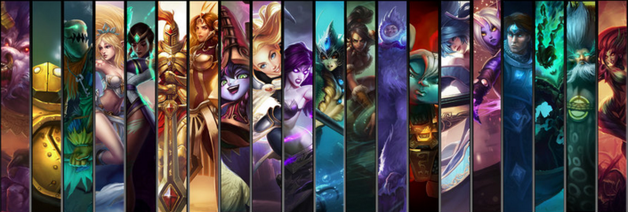

Victorious Series by [Jinx™](https://www.joduska.me/forum/user/1178097-mephistos/)
===

What is the [Victorious Series](https://github.com/VictoriousSupport/VictoriousSeries)?
---

> Leaguesharp Assembly of the support, by the support, for the support...

Supported Champion
---

1. **Soraka**
 - Origin: Sophie's Soraka by ChewyMoon
 - Q/E Cast: OKTW Prediction
 - New R Logic: [Jinx™](https://www.joduska.me/forum/user/1178097-mephistos/)
2. **Nami**
 - Origin: ElNami:ReBurrito by jQuery
 - Q Cast: OKTW Prediction
 - New R Logic: [Jinx™](https://www.joduska.me/forum/user/1178097-mephistos/)
3. **Thresh**
 - Origin: Thresh - The ruler of the soul by Kaiser
 - Q Cast: OKTW Prediction / SPrediction
 - New W(Key) Logic: [Jinx™](https://www.joduska.me/forum/user/1178097-mephistos/)
4. **Alistar**
 - Origin: ElAlistarReborn by jQuery
 - WQ Cast: jQuery
 - New Q+W Logic: [Jinx™](https://www.joduska.me/forum/user/1178097-mephistos/)
5. **Lulu**
 - Origin: HeavenStrikeLulu by badao + Lulu# by Kortatu
 - Q Cast: OKTW Prediction
 - New Q+E Logic: [Jinx™](https://www.joduska.me/forum/user/1178097-mephistos/)
6. **Bard**
 - Origin: Bard - The Dream Wanderer by Asuna
 - Q(Stun)/R Cast: OKTW Prediction
 - New Q Stun Logic (Harass/Combo): [Jinx™](https://www.joduska.me/forum/user/1178097-mephistos/)
 - New R Logic (Manual): [Jinx™](https://www.joduska.me/forum/user/1178097-mephistos/)
7. **Sivir (ADC)**
 - Origin: JustSivir by Justy (Framework) / OneKeyToWin AIO by Sebby (Logic)
 - Q Cast: OKTW Prediction
 - New Q Harss Logic: [Jinx™](https://www.joduska.me/forum/user/1178097-mephistos/)
 - New R Logic : [Jinx™](https://www.joduska.me/forum/user/1178097-mephistos/)
 - New E Shield Logic (Perfact): [Jinx™](https://www.joduska.me/forum/user/1178097-mephistos/)
8. **Tristana (ADC)**
 - Origin: Eltristana by jQuery
 - Delete W Logic
 - Jungle Logic: OKTW 
 - New E Harass Logic:[Jinx™](https://www.joduska.me/forum/user/1178097-mephistos/)
9. **Blitzcrank**
 - Origin: OKTW by Sebby
10. Sona (WIP)
 - Origin: ElEasy by jQuery
11. Leona (WIP)
 - Origin: ElEasy by jQuery

Version History
---
  - [6.3.4.0]
    - Blitzcrank 챔피언 추가 (동작 미확인)
  - [6.3.3.6]
    - SebbyLib 적용: OKTW Predtion의 유지보수가 필요없이 업데이트 되는 라이브러리를 사용. 
	- SebbyLib OKTW Predition 적용 챔피언
	  - Tresh Q/W
	  - Bard Q (with Wall), R (Circle)
	  - Soraka Q (Circle), E (콤보시 CC 걸려있는 타겟에 우선 적용하는 것으로 변경)
	  - Lulu Q
	  - Nami Q
	  - Sivir Q
	- SPrediction 적용: 기존 Common Prediction 개선
	  - Tresh Q 에 시범적용 (OKTW/SPrediction 선택 가능)
	- Sivir E 로 막을 수 있는 기술 별도 표시 
	  - 실제 논타겟 블럭킹은 ezVade 에서 수행하도록 함.
	  - 여기는 .unit 기반 기술만 막는 것이 맞음. (ezVade 에서 막지 못하는 스킬 막기)
  - [6.3.3.3]
    - ADC 챔프의 경우 자동으로 LessAttack 모드로 변경, Support Mode 사라짐
	- AP/Support 챔프의 경우 자동으로 LessCast 모드로 변경, Support Mode 활성화
	- 그 외의 경우에는 Auto Priority 로 변경됨
  - [6.3.3.1]
    - 챔피언에 맞춰 타겟모드 자동 설정 (ADC=LessAttack / AP=LessCast)
    - **Tristana**
     - Harass 모드 강화
        - E Logic: C/V Key 상태일때 적이 CC에 걸렸을때 발동
     - Smart Laneclear (with E Logic)
        - E Logic: 미니언이 11마리 이상 일때
     - E가 활성화 되면 이후 모든 타겟 포커스를 해당 타겟으로 이동하는 특징을 가짐.
        - Combo/Harass/LaneClear 등 어떤 상태이던지 폭탄이 올려있는 타겟을 우선 때림
  - [6.3.2.8]
    - 룰루 E Logic 변경 (Passive Mode)
     - Passive Mode Toggle Key 설정 가능 (기본 N Key + Drawing)
     - Passive Mode 일 경우에는 E 스킬을 무조건 방어 용도로만 사용함. (콤보일때도 사용하지 않음)
     - Spellbook 지정으로 해당 기술이 발동되면 우선적으로 방어함.
     - My ADC 를 선택할 수 있어, 룰루 + 우리 원딜을 보호하도록 설정 가능
     - 특정 수치 이상의 데미지가 들어오면 보호막 발동 (보호막은 방어가능수치 만큼만 보호하고, 사라짐) 

  - [6.3.2.6]
    - 시비르 E Shield Logic 수정
    - 서폿모드시 주변 챔피언에 상관없이 항상 미니언을 치지 않음으로 변경 (C/V Key 용도를 새롭게 하기 위함.)
	  - Lulu: C Key는 일반 E Harass / V Key는 E+Q Harass
	  - Alistar: C Key는 WQ 콤보 / V Key 는 QW 콤보
	  - 일반 Moveto 명령은 휴머나이저가 적용이 되어 있지 않아 사용하기 두려움!

  - [6.3.2.4]
    - 시비르 E Shield Logic (All New)
    - 시비르 W Logic 수정
    - 시비르 기타 버그 수정

  - [6.3.2.2]
    - 소라카/나미 Circle Skill Logic (AOE) 개선 (소라카 Q/E, 나미 Q)
    - **Sivir**
     - Harass 모드 강화
        - Q Logic: AOE(멀티타겟) && 사거리 950 이상에 2타 가능할시
     - Smart Laneclear (with W Logic)
        - W Logic: 미니언이 11마리 이상 일때
     - Selectable E Shield
        - E Logic: 모든 기술에 대해 E Cast 를 선택할 수 있도록 정의
     - 보수적이고 제한적인 R Logic
        - R Logic: Q 사거리내 적군 2명이상, R 사거리내 아군 3명이상이면 자동 발동

  - [6.3.1.2]
    - 어셈블리 명칭 변경 (Victorious Support → Victorious Series)
    - 알리스타 QW 콤보 Keybind 변경 (Mixed→Normal "T" Key)
    - 롤 6.3 패치 알리스타 수정 구문 반영
    - **Bard 추가**
     - Q 사거리 표시 OnDraw() 추가
     - Q Stun 모드 개선 (OKTW Prediction 기반)
     - Harass 모드시는 Stun 모드로만 동작함.
     - Combo 모드에서는 우선 Stun 모드로 동작하고, 이후에 기존 로직 동작
     - 발동조건: 
        - 챔피언 타겟이 1명: Q 스킬 관통후 뒤에 벽이 있으면 기술 시전 (Wall Check)
        - 챔피언 타겟이 2명 이상이면 기술 시전 (AOE)
     - Manual R (OKTW Prediction / Default Key: N) 추가 
        - 발동조건: 지정된 타켓에 2명 이상 기술이 적중할 경우 발동

  - [6.0.1.8]
    - GitHub 릴리즈
    - Tresh 통합 작업 완료
    - 로딩 출력 메세지 수정
    - 나미 궁극기(R) 로직 수정
